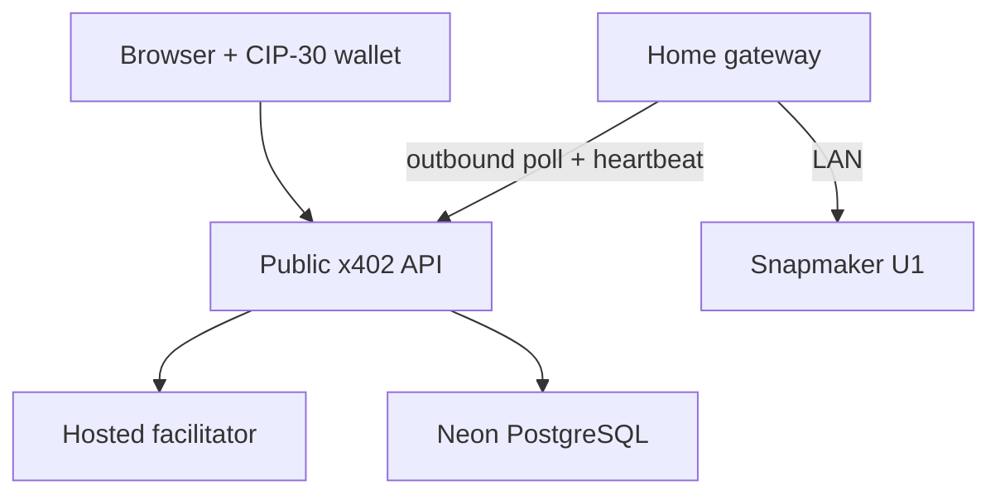

# 402 Print Protocol

A Cardano x402 storefront that turns an actual CIP-30 wallet payment into a supervised Snapmaker U1 print. The site explains HTTP 402, displays the payment conversation, tracks an order, and shows a rotatable 3D token from a centered top view. An operator groups up to four paid orders into one prepared print plate. The private `/admin` dashboard shows delivery details and print states, supports manual shipping confirmation, and lets reviewed failures return to a new print batch.

**Network:** Set `CARDANO_NETWORK=cardano:preprod` while validating the flow, then configure `cardano:mainnet` with matching seller and provider credentials for sales. There is no simulated payment or printer path. A configured hosted facilitator and reachable U1 Moonraker service are required even for local Docker.

| Path | Purpose |
| --- | --- |
| `apps/web` | React/Vite storefront and private operator dashboard; Evolution SDK CIP-30 signer |
| `apps/api` | Hono x402 resource server for Workers or Node, Neon/Postgres orders, settlement journal and gateway queue |
| `apps/gateway` | Outbound-polling home agent, authenticated to API, with Moonraker upload/start/status |
| `model` | OpenSCAD source and printable 54 mm STL |
| `prints` | Operator-sliced 1–4 copy U1 G-code plates (G-code is never committed) |
| `db` | Schema plus incremental migrations |

## Run locally with real services

1. Copy `.env.local.example` to `.env`. Choose preprod or mainnet. Enter your **working hosted facilitator URL**, matching `addr_test1…` or `addr1…` seller address, Blockfrost project ID for that network, and independent random admin/gateway tokens (`openssl rand -hex 32`). Set `MOONRAKER_URL` to your U1's LAN Moonraker endpoint reachable by Docker.
2. Slice `model/proof-token.stl` with your U1 profile into 1, 2, 3 and 4 copy plates. Place `proof-token-1.gcode` through `proof-token-4.gcode` in `prints/`.
3. Run `docker compose up --build`. Wait for the gateway heartbeat. Open http://localhost:5173. Select your CIP-30 wallet on the configured network, place an order and confirm the actual transaction. The operator view is at http://localhost:5173/admin with your `ADMIN_TOKEN`.
4. Create a batch from paid orders while physically supervising the U1. After the one permitted launch, inspect the printer and gateway journal before restarting the gateway to re-arm it.

No public printer port is mapped. Checkout shows **Gateway offline**, **Awaiting operator**, **Printer not ready**, or **Paused by operator** according to the actual condition; it refreshes automatically every 15 seconds. A new local setup will show **Gateway offline** until the first heartbeat. Check `docker compose logs gateway` and the four files in `prints/` when it shows **Printer not ready**. The shop blocks new orders when the gateway heartbeat is stale, the printer is not idle, or any required plate file is missing. A previously paid order remains in the durable queue if the gateway goes offline. The Compose migration job applies all idempotent SQL files in order on each start, including upgrades of an existing local volume.

If the gateway reports `ECONNREFUSED ...:8787`, check `docker compose ps` and `docker compose logs --tail=100 api migrate`. This is the gateway-to-API connection, separate from the U1. Compose waits for `/api/health` before starting the gateway. A later connection failure means the API became unavailable and requires inspection of its logs.

The gateway never receives shipping details. The browser never contacts Moonraker or your home IP. A signed payment is reserved against one order before the facilitator can submit it; interrupted requests retry the same signed transaction, while the operator can inspect the payment attempt. Printing is one-shot with a persistent launch journal to avoid accidental duplicate starts.

See [deployment](docs/DEPLOYMENT.md), [operations](docs/OPERATIONS.md), [architecture](docs/ARCHITECTURE.md) and [security](docs/SECURITY.md). The source is [MIT licensed](LICENSE). The Cardano signing/payment flow is adapted from the [Cardano Foundation x402 demo](https://github.com/cardano-foundation/x402-cardano-demo) with attribution in source.
