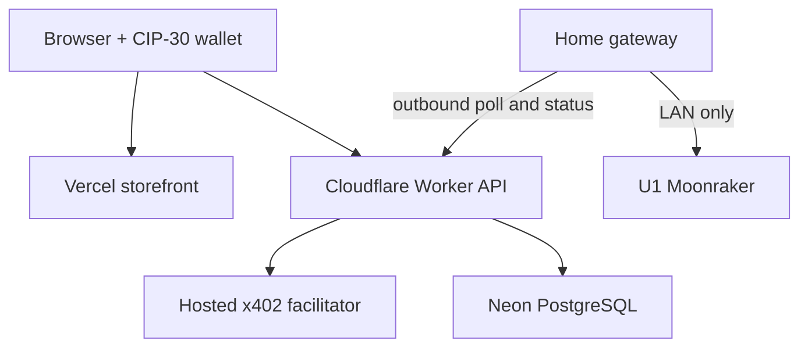

# 402 Print Protocol

An experimental Cardano mainnet x402 storefront that turns one payment into one physical 3D printed **Proof of Print** token. The site explains the HTTP 402 exchange, shows the actual payment offer and settlement receipt, and tracks a private order. A separate operator dashboard groups paid orders into plates of up to four.

> **Launch status:** implementation and local simulation are ready for review. Mainnet payment, the hosted facilitator, your U1's Moonraker endpoint, fulfillment, and the hosting plan must be verified with your own credentials before accepting real orders. The local Docker demo never moves ADA.

## What is inside

| Path | Purpose |
|---|---|
| `apps/web` | React/Vite storefront for Vercel, Three.js interactive exploded token, CIP-30 mainnet wallet flow and admin dashboard |
| `apps/api` | Hono x402 API for Cloudflare Workers, Neon persistence, private gateway queue and admin endpoints |
| `apps/gateway` | Home-hosted printer agent: outbound API poll, optional push endpoint, Moonraker upload/start/status |
| `model` | Editable OpenSCAD model and binary STL (54 mm one-piece token) |
| `db` | PostgreSQL schema |
| `docker-compose.yml` | Local web, API, PostgreSQL, mock printer and simulated payment |
| `gateway-compose.yml` | Private production gateway, outbound only |

## Try the local demo

```sh
docker compose up --build
```

Open **http://localhost:5173**, order with a sample German address, and press **Simulate HTTP 402 payment**. The trace shows the real HTTP 402 and simulated payment completion. Open **http://localhost:5173/admin** with token `local-admin-token-replace-before-exposure-000001`; create a batch. The mock gateway needs up to 15 seconds to poll and 12 seconds to "print". Its token and the hardcoded database password are **local development only**. Never publish the local ports or reuse these values.

`docker compose down` keeps order and journal volumes; `docker compose down -v` removes them. The gateway is armed for one launch per process. Restart it for the next supervised local batch: `docker compose restart gateway`.

You can also use `npm ci && npm run build` for type checks and a production web build. This repository has no hosted infrastructure or live payment credentials baked into it.

## Mainnet architecture



The browser never connects to the printer or home network. The home gateway makes outbound HTTPS requests to the API; **no reverse proxy, port forward, tunnel, or public home address is required**. The API can optionally push to a Cloudflare Tunnel protected by Access, but outbound polling is the recommended initial deployment and leaves `GATEWAY_URL` unset. The API cannot expose a private LAN address it does not know.

The frontend requests an order, calls `POST /api/orders/{id}/pay` and receives HTTP 402. The browser constructs and signs a Cardano mainnet transaction with the first available CIP-30 wallet, then retries using `PAYMENT-SIGNATURE`. The API delegates verification and settlement to the configured hosted facilitator, checks the `PAYMENT-RESPONSE`, and persists the paid order. The private gateway only sees a batch ID, count and status. **It never receives shipping details.** Operator and gateway secrets are distinct.

See [deployment](docs/DEPLOYMENT.md), [operations](docs/OPERATIONS.md), and [security and limits](docs/SECURITY.md).

## Source and licensing

See [LICENSE](LICENSE). Contributions and review welcome. The original Cardano signing/payment flow is adapted from the [Cardano Foundation x402 demo](https://github.com/cardano-foundation/x402-cardano-demo), with attribution in source. The STL is derived from `model/proof-token.scad`.
