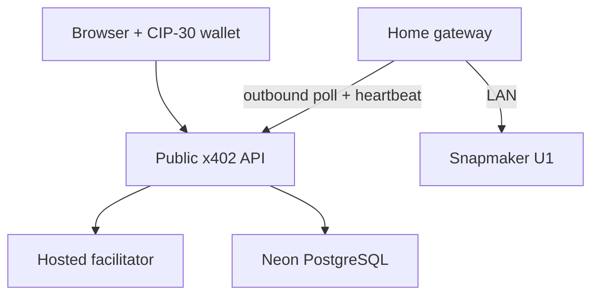

# 402 Print Protocol

A Cardano x402 storefront that turns an actual CIP-30 wallet payment into a supervised Snapmaker U1 print. The site explains HTTP 402, displays the payment conversation, tracks an order, and shows a rotatable 3D token from a centered top view. An operator groups up to four paid orders into one prepared print plate. The private `/admin` dashboard shows delivery details, country, a paginated shipping queue and print states. After each plate, the operator confirms its physical result before the backend assigns the next four paid orders. Reviewed failures can return to a new batch without another payment.

**Network:** Set `CARDANO_NETWORK=cardano:preprod` while validating the flow, then configure `cardano:mainnet` with matching seller and provider credentials for sales. There is no simulated payment or printer path. A configured hosted facilitator is required to settle payments. The U1 Moonraker service can be temporarily offline: paid jobs wait until it returns.

| Path | Purpose |
| --- | --- |
| `apps/web` | React/Vite storefront and private operator dashboard; Evolution SDK CIP-30 signer |
| `apps/api` | Hono x402 resource server for Workers or Node, Neon/Postgres orders, settlement journal and gateway queue |
| `apps/gateway` | Outbound-polling home agent, authenticated to API, with Moonraker upload/start/status |
| `model` | OpenSCAD source and printable 54 mm STL |
| `prints` | Operator-sliced 1–4 copy U1 G-code plates (G-code is never committed) |
| `db` | Schema plus incremental migrations |

## Run locally with real services

1. Copy `.env.local.example` to `.env`. Choose preprod or mainnet. Enter your **working hosted facilitator URL**, matching `addr_test1…` or `addr1…` seller address, Blockfrost project ID for that network, and independent random admin/gateway tokens (`openssl rand -hex 32`). Set `MOONRAKER_URL` to your U1's LAN Moonraker endpoint reachable by Docker.
2. Slice `model/proof-token.stl` with your U1 profile into 1, 2, 3 and 4 copy plates. Place `proof-token-1.gcode` through `proof-token-4.gcode` in `prints/`.
3. Run `docker compose up --build`. Wait for the gateway heartbeat. Open http://localhost:5173. Select your CIP-30 wallet on the configured network, place an order and confirm the actual transaction. The operator view is at http://localhost:5173/admin with your `ADMIN_TOKEN`.
4. Inspect the idle U1, use **Arm / resume gateway** in the dashboard, and create the first batch from paid orders. Compose starts the gateway disarmed. After the gateway reports a completed plate, inspect the print and click **Confirm plate & queue next four** in `/admin`. The gateway rearms after a confirmed printer completion; the database keeps the next job gated until your confirmation. A failed or ambiguous print remains disarmed and requires manual review before restarting the gateway.

No public printer port is mapped or opened by the gateway process. Printer readiness is an operator concern; the storefront only shows whether orders are open or paused. **A printer or gateway outage does not block checkout or payment**: paid orders wait in the database until the operator recovers the printer. The operator can pause sales manually in `/admin`. The live protocol trace shows timestamped payment events, offer checks, wallet signing, HTTP responses and settlement details. Check `docker compose logs gateway` and the four files in `prints/` when it shows **Printer not ready**. The Compose migration job applies all idempotent SQL files in order on each start, including upgrades of an existing local volume.

If the gateway reports `ECONNREFUSED ...:8787`, check `docker compose ps` and `docker compose logs --tail=100 api migrate`. This is the gateway-to-API connection, separate from the U1. Compose waits for `/api/health` before starting the gateway. A later connection failure means the API became unavailable and requires inspection of its logs.

The gateway never receives shipping details. The browser never contacts Moonraker or your home IP. A signed payment is reserved against one order before the facilitator can submit it; interrupted requests retry the same signed transaction, while the operator can inspect the payment attempt. Batch creation and confirmation are serialized under a Postgres row lock. The gateway claims a queued batch atomically and journals it before upload/start to avoid accidental duplicate launches. An ambiguous start is never retried automatically.

The production review and remaining launch checks are in [production review](docs/PRODUCTION_REVIEW.md). Compose serves a compiled frontend through Nginx.

See [deployment](docs/DEPLOYMENT.md), [operations](docs/OPERATIONS.md), [architecture](docs/ARCHITECTURE.md) and [security](docs/SECURITY.md). The source is [MIT licensed](LICENSE). The Cardano signing/payment flow is adapted from the [Cardano Foundation x402 demo](https://github.com/cardano-foundation/x402-cardano-demo) with attribution in source.
