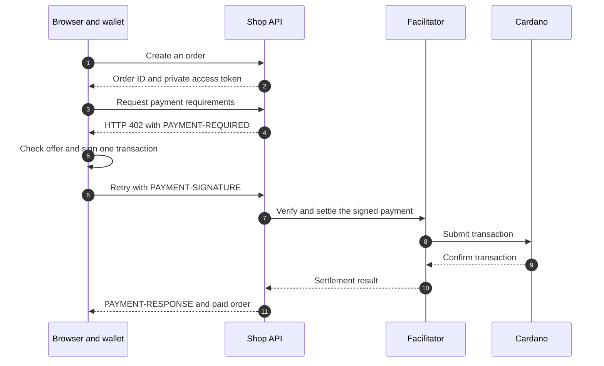
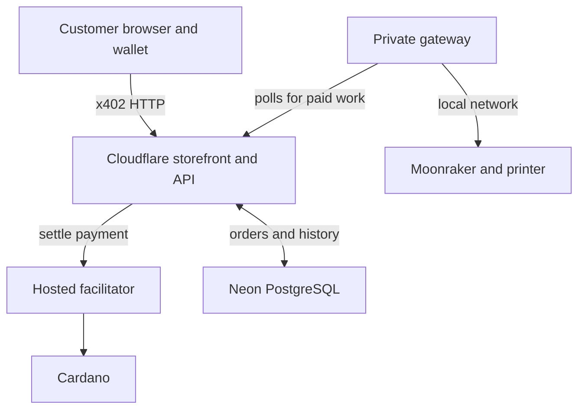

# 402 Print Protocol

**A Cardano payment becomes a physical order.** A customer orders a small 3D-printed token, pays from a Cardano wallet through x402, watches the payment conversation, and can later check the transaction hash. Once payment is recorded, the order waits for an operator to print and ship it.

[Try the preprod storefront](https://x402-cardano-3dprinting-preprod.th-kammerlocher.workers.dev/) · [Deploy your own](docs/DEPLOYMENT.md)

> **Preprod is a test network.** It uses test ADA and does not result in a shipment. A mainnet storefront uses real ADA and needs its own configuration and fulfillment operation.

## What does x402 do?

HTTP **402 Payment Required** tells a client that a resource has a price. x402 makes the price and payment proof machine-readable. In this shop, the payment offer asks for an **exact amount of ADA** on Cardano, represented in lovelace (1 ADA = 1,000,000 lovelace). The browser uses the official `@x402/cardano` client scheme, and the API uses the matching server scheme and a hosted facilitator.

The page shows a live protocol trace. You can see the initial 402 offer, the wallet signature, the retry with payment attached, and the settlement result. The wallet's private keys never go to the shop server.

### One order, from request to payment



The two requests to the payment endpoint look like this. Header values are shortened for illustration:

```http
POST /api/orders/{order-id}/pay
X-Order-Secret: ...

HTTP/1.1 402 Payment Required
PAYMENT-REQUIRED: ...network, amount, asset, payTo...

POST /api/orders/{order-id}/pay
X-Order-Secret: ...
PAYMENT-SIGNATURE: ...signed Cardano transaction...

HTTP/1.1 200 OK
PAYMENT-RESPONSE: ...successful settlement receipt...
```

Before signing, the browser checks the offered **network, receiving address, asset and exact amount** against the order. The API records the signed transaction hash against that order before asking the facilitator to settle it. On success, it checks the receipt's transaction hash and network, saves the payment, and moves the order to **PAID**. The example shows the successful path; a real settlement can take longer or return an uncertain response.

### What if confirmation is slow?

A timeout or another HTTP 402 after signing does **not** prove the transaction failed. The app retries the **same signed payment**, keeping its transaction hash attached to the order. A customer can check that hash later without reconnecting a wallet. If the facilitator has not yet confirmed it, the API can verify a stored transaction against Cardano through Blockfrost. If the result is still uncertain, the order stays awaiting payment for review; it is not released to the printer or discarded. [How recovery works](docs/PAYMENT_RECOVERY.md).

## From paid order to shipped print

Payment and printing are separate steps. The database keeps the paid order even when the printer, gateway, or customer browser is offline.

1. **Queue:** The API stores a paid order with its transaction hash and delivery details. The private printer gateway polls the API for work; it does not receive the customer's address.
2. **Start a plate:** The operator checks the printer, removes previous objects, confirms the plate is empty, and clicks **Start the next batch** in `/admin`. Available G-code files determine supported batch sizes.
3. **Print and recover:** The gateway talks to Moonraker on the printer's private network. An uncertain start or damaged print requires operator inspection. Reprints use the order already paid for.
4. **Fulfill:** The admin dashboard shows which orders are printing, ready to send, and sent, with the delivery details needed to package them. The operator marks each order as sent after dispatch.

A completed print **never** starts the next plate by itself. A printer outage does not block payment; paid orders wait until the operator restores the gateway and starts a plate. [Printer gateway guide](docs/GATEWAY_DEPLOYMENT.md) · [Daily operations](docs/OPERATIONS.md).

## How the application is put together

For the hosted setup, the browser and printer reach the same API from different sides. The gateway initiates its own outbound connection; the printer is not exposed to the internet.



| Part | Responsibility | Why it matters |
| --- | --- | --- |
| `apps/web` | Storefront, CIP-30 wallet, x402 trace, transaction lookup and admin UI | The customer sees the offer and authorizes the exact Cardano payment |
| `apps/api` | HTTP 402 endpoint, facilitator integration, orders, payment recovery and admin actions | Payment is checked and persisted before fulfillment can begin |
| `db` | PostgreSQL orders, payment attempts, print batches and history | A browser close or printer outage does not erase work |
| `apps/gateway` | Outbound polling, durable printer journal and Moonraker connection | The printer stays on a private network and uncertain starts get reviewed |
| `model` and `prints` | Token model and operator-sliced `proof-token-N.gcode` plates | The operator can supply tested G-code for each supported batch size |

The hosted layout serves the frontend and API from one Cloudflare Worker, keeps orders in Neon PostgreSQL, and runs only the outbound gateway near the printer. The local Compose layout runs the web server, API, Postgres, migrations and gateway together. [Architecture notes](docs/ARCHITECTURE.md).

## Run it locally

You need Docker Compose, a CIP-30 wallet on the selected Cardano network, a compatible hosted x402 facilitator, a matching seller address, a Blockfrost project ID, and a printer reachable through Moonraker. Payments and printer actions are real; there is no fake facilitator or printer mode.

1. Copy `.env.local.example` to `.env` and fill in the values for the chosen network. Use two different random 64-character hex values for `ADMIN_TOKEN` and `GATEWAY_TOKEN` (`openssl rand -hex 32`). For local HTTP, set `FRONTEND_ORIGIN=http://localhost:5173` and `ADMIN_ALLOW_INSECURE_LOCALHOST=true`.
2. Put printer-tested files such as `proof-token-1.gcode` and `proof-token-4.gcode` in `prints/`. The number is the object count on that plate. Include a one-object file.
3. Run `docker compose up -d --build`. Open the [storefront](http://localhost:5173) and the [admin dashboard](http://localhost:5173/admin).

For Cloudflare, Neon and a gateway-only server, follow the [deployment guide](docs/DEPLOYMENT.md). Keep `VITE_BLOCKFROST_*_PROJECT_ID` in the **frontend build environment** for the selected network and `BLOCKFROST_*_PROJECT_ID` in the **API runtime** for chain recovery. Browser build values are public. The gateway needs neither project ID.

## Before accepting real orders

A working payment demo is one part of a commercial service. Before mainnet sales, verify real wallet and facilitator behavior, recovery after interrupted requests, backup restoration, printer failure handling, shipping costs and destinations, customer support, refunds, privacy notices, admin access and monitoring. A refund action in the dashboard records a refund that was made separately; it does not transfer ADA. See the [production review](docs/PRODUCTION_REVIEW.md), [security guide](docs/SECURITY.md), and [operations guide](docs/OPERATIONS.md) for the checks and limits.

The browser signing flow is adapted from the [Cardano Foundation x402 demo](https://github.com/cardano-foundation/x402-cardano-demo). Review the [open-source release checklist](docs/OPEN_SOURCE_CHECKLIST.md) for the upstream licensing issue before redistributing that adapted code. Contributions are covered in [CONTRIBUTING.md](CONTRIBUTING.md).
