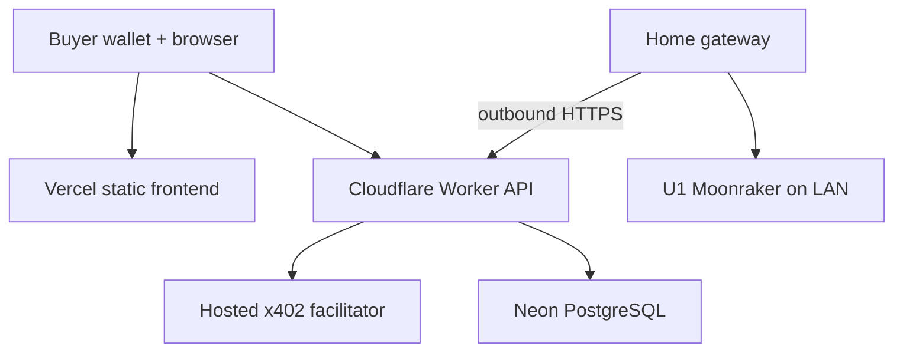

# Implemented architecture

This document supersedes the initial proposal. The implementation uses a static React/Vite frontend, a Cloudflare Worker API, Neon PostgreSQL, a hosted Cardano x402 facilitator, and an outbound-polling home gateway. See [deployment](DEPLOYMENT.md) and [security limits](SECURITY.md).

The browser sees only the public API, payment offer, and transaction receipt. It cannot access the printer. The operator's home IP is absent from this route. No tunnel or port forward is needed for the default gateway. The optional API-to-gateway push uses Cloudflare Tunnel plus Access and bearer auth. A reverse proxy with a direct home port forward is deliberately not configured.

## Data flow

1. Create an order with German delivery details; return a random access secret, store only its hash. The fixed price is copied to the order.
2. `POST /api/orders/:id/pay` returns an x402 HTTP 402 offer. A CIP-30 wallet signs the mainnet transaction; the browser retries with `PAYMENT-SIGNATURE`.
3. The hosted facilitator verifies and settles; the API checks the settlement receipt and writes the transaction hash and paid state to Neon. Ambiguous failures retain the signed payment in browser session storage for same-signature retry. Manual reconciliation remains necessary if payment succeeded while persistence failed.
4. The operator sees private customer/order data and creates a batch of up to four paid orders. The gateway polls for queued batches, checks a pre-sliced N-copy G-code file and printer idle state, journals the launch, and reports progress. It is armed for one launch per process.
5. The operator inspects output, packs separate shipments, and marks each order shipped. No customer address is sent to the gateway.

## Production gaps

The UI has no independent on-chain reconciliation, email notifications, retention scheduler, refund transfer, shipping label or rate-limit service. The existing U1 Moonraker adapter and hosted facilitator must be validated against the actual deployed devices/services. Local Docker uses an explicitly labeled simulated payment and mock printer; it is not a mainnet proof. Vercel Hobby is unsuitable for real sales under its commercial restrictions; use a commercial plan or another eligible static host. The Cloudflare Worker Free CPU limit may require a paid plan for this SDK.
