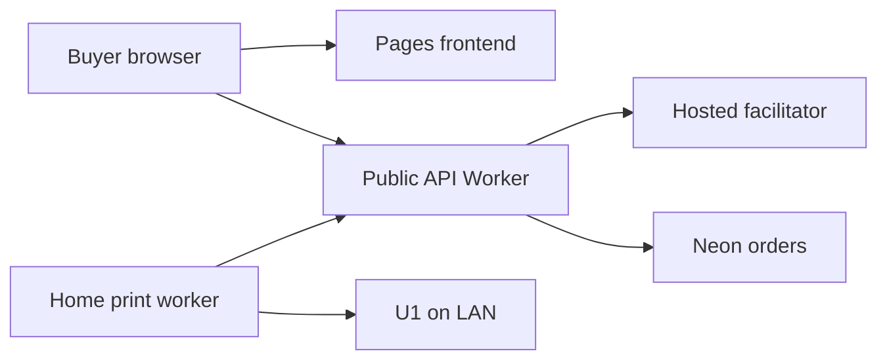

# Cardano x402 3D Print Shop — architecture plan

Status: proposal, 24 September 2026. This document is the plan before implementation.

## Goal

A visitor learns how HTTP 402 and Cardano x402 work, chooses one small physical print, pays on Cardano mainnet, follows the real protocol exchange, and receives an order. A local Snapmaker U1 prints only after confirmed payment and an available, prepared printer. The public system never calls the printer or reveals the home IP, LAN address, camera endpoint, or Moonraker credentials.

## Hosting decision

The requested combination of **Vercel free hosting and real sales** is unavailable: Vercel Hobby restricts sites that process payments or advertise products to non-commercial use. Use one of these two deployments:

| Component | Recommended $0 subscription path | If Vercel is required |
| --- | --- | --- |
| Public frontend | Cloudflare Pages, static React + Vite site, connected to GitHub | Vercel Pro, same static frontend |
| Public resource server / API | Cloudflare Worker, Hono or Fetch API, Cardano x402 resource server | Vercel Functions on Pro, Node runtime |
| Database | Neon Free Postgres, HTTP serverless driver | Same |
| Facilitator | Hosted Cardano mainnet facilitator provided by project | Same |
| Printer worker | Small Node service on an existing computer at home, outbound HTTPS polling | Same |
| Printer | U1's local Moonraker API, reachable only from home network | Same |
| Public URL | Free `*.pages.dev` plus `*.workers.dev`, or an owned custom domain | Vercel domain or owned custom domain |

Cloudflare Workers Free currently publishes 100,000 requests/day and 10 ms CPU per invocation. Network waiting does not count toward CPU, but the **Cardano SDK's Worker runtime compatibility and CPU budget are an explicit first implementation gate**. If this fails, use the Vercel Pro path or host only the public API behind a Cloudflare Tunnel on the existing home server. A tunnel needs no inbound port and hides the origin IP from visitors, but it gives the public API a dependency on home uptime. The outbound worker design remains the preferred separation.

The services can start at $0/month in the recommended path, within their limits. This excludes a domain, filament, electricity, packaging, shipping, network transaction fees, possible facilitator fees, and any paid provider upgrade. A free tier is not a service-level guarantee.

## Trust boundaries

The home worker initiates all connections to the API. There are **no router port forwards, inbound VPN peers, public printer endpoints, public camera streams, or DNS records pointing to the home connection**. The worker's local configuration holds the U1 LAN address and Moonraker credential. Cloud secrets hold database credentials, facilitator credentials, chain-provider key, and worker authentication material. The frontend receives none of these secrets.

The API is intentionally public for buyers, but only its purchase endpoints are public. Operator and worker endpoints require separate authentication. Order access uses an unguessable, per-order token stored as a hash; a wallet address alone is not an order credential. Rate limits and size limits protect order creation and status polling.

## Purchase and print sequence

1. Browser loads the explainer, model previews, fixed price, supported shipping area, estimated print and dispatch times, and current availability. For the first release, offer **one small, tested, pre-sliced model**, with a finite queue capacity. No visitor-supplied G-code or STL.
2. Buyer enters the fulfillment details before payment. The API validates delivery area, total including shipping, capacity, and order expiry, then stores an `AWAITING_PAYMENT` order in Neon. The browser gets an order ID and secret recovery link. Contact/address data are private and never enter an on-chain datum or public protocol inspector.
3. Browser requests the order-specific paid resource, such as `POST /orders/{id}/purchase`. The API returns an actual HTTP **402** with a `PAYMENT-REQUIRED` header for `cardano:mainnet`, the exact asset and amount, seller address, and expiry. The UI decodes a **redacted** view of the real response. An expired quote cannot be reused.
4. A CIP-30 wallet builds and signs the Cardano transaction. The browser retries that same resource with `PAYMENT-SIGNATURE`. The server delegates verification and settlement to the supplied hosted facilitator. Do not accept an arbitrary tx hash, a frontend success flag, or a mere mempool broadcast as proof of payment.
5. When the configured confirmation policy is met, the API atomically records the settled transaction hash, paid amount/asset, order ID, and `PAID_QUEUED` state. A unique transaction constraint prevents one payment from purchasing two orders. The server returns the actual `PAYMENT-RESPONSE` receipt. The UI shows the real network exchange and a mainnet explorer link.
6. The local worker polls `POST /worker/jobs/claim` over outbound HTTPS. An authenticated, atomic claim reserves at most one job. The operator first clears the build plate and arms one print; software checks printer readiness, material mapping, and queue state. It uploads the allowed, locally pre-sliced file through Moonraker and starts it. It reports `PRINTING`, progress, `PRINTED`, or `NEEDS_REVIEW` to the API. Dispatch must never be retried blindly if the printer's response is ambiguous.
7. An operator removes and inspects the print, packs it, and marks `READY_TO_SHIP` / `SHIPPED` with tracking or a pickup note. The order page follows each state. Payment buys a print order, not an instant guaranteed artifact.

### Recovery rules

- The exact signed payment is retained locally until its outcome is known. A disconnected browser retries **the same signed transaction**, never prompts a second payment merely because an HTTP response was lost. The API/facilitator reconcile pending settlement after restart.
- A payment can settle while Neon or the browser is temporarily unavailable. Store a durable payment attempt tied to the order before submission and reconcile by transaction hash; paid orders must not disappear or require a second payment.
- Database transitions are conditional and idempotent. Keep a unique transaction hash, claim/lease ownership, and a durable audit trail. A printer start with uncertain result moves to operator review; it cannot auto-start again.
- If print, shipping, or payment reconciliation fails, show a clear support state and use an operator refund process. Direct x402 address payment has no automatic refund guarantee.
- A successful printer status does not prove that the object detached cleanly or that the build plate is empty. Require an operator to clear and rearm the printer between orders.
- Do not let the public checkout exceed the number of physical jobs the printer/operator can handle. The operator can pause new quotes while existing paid orders remain visible.

## Mainnet pricing

Start with a fixed ADA price above the minimum output requirement, plus the buyer's chain fee, and disclose the total before signing. Support the exact mainnet asset and network IDs advertised by the hosted facilitator. If a stable-value price is needed, add a supported native stablecoin later; buyers then need that asset and ADA for fees/minimum output. Record the offered amount and currency on the order, never recompute it after the wallet signs. Shipping prices must be fixed or calculated before issuing the 402.

## Educational UI

Build a polished, responsive studio experience rather than a generic checkout:

- Opening scene: interactive 3D model on a dark, tactile workbench; clear one-sentence promise: "An HTTP request that becomes a real object."
- Guided strip: **Request → 402 quote → wallet signature → facilitator → mainnet confirmation → printer → delivery**. Each stage unlocks when it actually happens. Show a live, accessible text equivalent for animation.
- Protocol inspector: two synchronized columns for "What you see" and "HTTP exchange". Display the actual method, status, selected redacted headers, decoded offer, network, asset, amount, and receipt; let developers expand the full safe JSON. Never reveal order secrets, private addresses, delivery details, API keys, or wallet internals.
- Buyer-friendly explanation of x402, Cardano, facilitator, wallet fee, settlement wait, and the distinction between **paid**, **printing**, and **shipped**. A mainnet explorer link anchors the proof.
- Progress screen: printer status and production timeline; optionally add still photos uploaded by the local worker later. Do not proxy a live LAN camera in the first release.
- Graceful mobile wallet handoff and an accessible fallback for people without a CIP-30 browser wallet. Agent/CLI purchases can use the same x402 resource route, while shipping still requires fulfillment details.

## Data and API boundaries

Minimum tables: `products`, `orders`, `payment_attempts`, `print_jobs`, and `order_events`. Keep product price and shipping quote immutable per order. Sensitive customer data has restricted access and a defined retention policy; the open-source repository contains only schema/migrations and fake seed data. The operator dashboard has separate authentication and can pause sales, review uncertain payments, inspect jobs, and mark shipments or refunds.

Suggested endpoints: `GET /catalog`, `POST /orders`, `GET /orders/{id}`, `POST /orders/{id}/purchase` (x402), `POST /worker/jobs/claim`, `POST /worker/jobs/{id}/events`, and operator endpoints. Never let the browser directly update paid or printer states.

## Implementation gates

1. **Cloud feasibility spike:** Deploy a minimal Worker with `@x402/cardano` + hosted facilitator configuration and Neon HTTP. Measure CPU and prove a real 402 → signed payment → confirmed mainnet receipt on a low-price route. If it exceeds the Free budget, switch only the API host while preserving the contract.
2. **U1 feasibility spike:** From the home worker machine, query the stock U1 Moonraker endpoint and upload/start a known safe file with operator present. Record firmware/API differences; never expose the printer publicly.
3. **Order engine:** Migrations, order-specific exact quotes, atomic settlement persistence, replay/duplicate protections, worker claim protocol, recovery states, operator controls.
4. **Buyer experience:** Visual site, CIP-30 wallet flow, truthful protocol inspector, accessible status tracking and mobile layout.
5. **End-to-end launch gates:** Preprod failure-path test, small mainnet purchase on the real facilitator, printer job with a clear plate, lost-response recovery, shipping/refund workflow, secret scan, and operational monitoring. No mock payment is presented as mainnet proof.

## Source references checked on 24 September 2026

- Vercel Hobby commercial restriction: https://vercel.com/docs/limits/fair-use-guidelines
- Cloudflare Workers Free limits: https://developers.cloudflare.com/workers/platform/limits/
- Cloudflare Pages GitHub deploy: https://developers.cloudflare.com/pages/configuration/git-integration/github-integration/
- Neon Free allowances: https://neon.com/blog/neon-backend-is-ga
- Neon serverless driver in Workers: https://neon.com/blog/serverless-driver-ga
- Cardano x402 route and CIP-30 template: https://developers.cardano.org/x402/ and https://developers.cardano.org/templates/x402-next/
- Snapmaker U1 Moonraker fork: https://github.com/Snapmaker/u1-moonraker
- Moonraker file upload and print start: https://moonraker.readthedocs.io/en/latest/external_api/file_manager/ and https://moonraker.readthedocs.io/en/latest/external_api/printer/
