# Privacy, Demo Terms and Order Cap Implementation Plan

**Goal** — The storefront can run on mainnet with a GDPR privacy notice, an Impressum, demo/shipping-only terms, self-hosted fonts, a required acknowledgement at checkout, automatic personal-data erasure after a retention period, and an env-configured total order cap. Delivered as a PR from `feat/privacy-demo-order-limit` into `dev`.

**Scope** — `apps/api`, `apps/web`, `db/`, `deploy/nginx.conf`, compose files, env examples, docs. Gateway untouched.

**Global constraints**
- Tests are immutable; new tests only.
- The settlement-claims ADR (2026-09-23) holds: erasure touches only personal columns (`customer_name`, `email`, `address_line1/2`, `postal_code`, `city`) — never `tx_hash`, `payment_attempts`, `order_events`, status or amounts.
- No real operator identity is invented: every legal detail comes from env vars, and the pages show a visible "not configured" warning when they are missing.
- Not legal advice. The texts are a reasonable GDPR Art. 13 / § 5 DDG template; the operator must review them.

---

## Summary

Three additions share one branch. **(1) Legal surface:** a `/api/legal` endpoint exposes operator details from env (`OPERATOR_NAME`, `OPERATOR_ADDRESS`, `OPERATOR_EMAIL`, optional `OPERATOR_PHONE`, `OPERATOR_VAT_ID`, `PRIVACY_SUPERVISORY_AUTHORITY`, `PII_RETENTION_DAYS`). The SPA renders `/privacy` and `/imprint` from it and links both in the footer and at checkout. **(2) Demo framing + acknowledgement:** the hero, checkout, price row and FAQ say plainly that this is a demo, the printed token is free, and the ADA covers shipping and handling only. A required checkout checkbox (an *acknowledgement* of the privacy notice and demo terms, not GDPR consent: the legal basis is Art. 6(1)(b)) is enforced in the UI. The API records `terms_acknowledged_at` when `acknowledged: true` is sent but does not reject without it, so the existing order tests (`offline-orders`, `production-recovery`, `checkout-preflight`) stay valid unchanged. The pay button reads "Pay shipping now / zahlungspflichtig bestellen" (§ 312j(3) BGB). **(3) Data minimisation:** Google Fonts are self-hosted via `@fontsource/*` (no visitor IP goes to Google), and a migration adds `orders.personal_data_erased_at`. An idempotent `erasePersonalData()` blanks personal columns of SHIPPED/REFUNDED orders older than `PII_RETENTION_DAYS` (default 90) and of unpaid orders with no payment attempt. It runs opportunistically on gateway heartbeats and admin order listings, since neither runtime has a scheduler. **(4) Order cap:** `MAX_ORDERS` (unset/0 = unlimited) closes checkout; the counting rule and enforcement are under *Order cap design* below.

## Diagram — order data lifecycle

```mermaid
stateDiagram-v2
  [*] --> AWAITING_PAYMENT: POST /api/orders (acknowledged, cap not reached)
  AWAITING_PAYMENT --> PAID: settled
  AWAITING_PAYMENT --> Erased_unpaid: no payment attempt, older than retention
  PAID --> SHIPPED: via batches / PRINTED
  PAID --> REFUNDED
  SHIPPED --> Erased: updated_at + PII_RETENTION_DAYS
  REFUNDED --> Erased: updated_at + PII_RETENTION_DAYS
  note right of Erased: name/email/address blanked, personal_data_erased_at set; tx_hash, amounts, events kept
```



## Change map

```
db/
  011_privacy_and_order_cap.sql            +6   ⚠ schema: ADD COLUMN IF NOT EXISTS personal_data_erased_at, terms_acknowledged_at
apps/api/src/
  index.ts                                 ~70  ⚠ public API: /api/legal; catalog soldOut/remaining; optional `acknowledged`; requeue refuses erased orders
  privacy.ts                               +35  new: erasePersonalData(env) + retention parsing
  orderCap.ts                              +20  ⚠ concurrency: shared `sold` SQL + cap parsing
  payment.ts                               ~25  ⚠ funds path: offer + reservation guarded by cap (pre-broadcast only)
apps/api/test/
  privacy-and-cap.test.mjs                 +200 new DB-backed tests (TEST_DATABASE_URL)
  legal.test.mjs                           +40  new non-DB tests (/api/legal, MAX_ORDERS parsing)
  payment-refused.test.mjs                 +50  new: payFlow maps X-Payment-Refused to a final "no payment taken" outcome
apps/web/
  src/Admin.tsx                            ~15  show sold / cap / oversold, "erased" orders
  package.json                             +3   @fontsource/dm-mono, dm-sans, space-grotesk
  index.html                               ~2   remove Google Fonts links
  src/style.css                            ~2   remove @import of Google Fonts
  src/main.tsx                             +6   import self-hosted fonts
  src/Legal.tsx                            +160 new: Privacy + Imprint pages
  src/App.tsx                              ~70  routing, demo notices, acknowledgement checkbox, sold-out state, footer links
  src/payFlow.ts                           ~15  ⚠ funds UX: X-Payment-Refused → final "refused, nothing taken" outcome
deploy/nginx.conf                          ~1   CSP drops fonts.googleapis/gstatic
docker-compose.yml                         +8   pass new env vars to api
.env.example, .env.local.example           +10
README.md, docs/DEPLOYMENT.md, docs/OPERATIONS.md   +30  legal config, retention, cap
```

## Risk table

| # | Change | Risk | Why | Review this |
|---|---|---|---|---|
| 1 | Order cap enforcement | High | Concurrency; a customer may pay after the cap is reached | Read line-by-line |
| 2 | `erasePersonalData` SQL | High | Irreversible deletion; must never hit orders still to be shipped or paid | Read line-by-line |
| 3 | payFlow refusal mapping | High | A wrong mapping could tell a customer "not paid" for a tx that may be on-chain | Read line-by-line; only the explicit header maps to final |
| 3b | `acknowledged` field + `/api/legal` | Low | Additive public API | Skim |
| 4 | Migration 011 | Medium | Schema; must be idempotent (Compose re-applies all files) | Read |
| 5 | Privacy / Imprint texts | Medium | Legal accuracy depends on operator review | Read text, not code |
| 6 | Self-hosted fonts + CSP | Low | Visual regression only | Skim, check build |
| 7 | Demo copy changes | Low | Copy only | Skim |

## Acceptance criteria

- [ ] Order with `acknowledged: true` stores `terms_acknowledged_at`; without it creation still works (existing tests unchanged) (test: `privacy-and-cap.test.mjs › records acknowledgement`)
- [ ] Erased unpaid order: offer → 409 + `X-Payment-Refused: ORDER_CLOSED`, new signed payment → 409, no `payment_attempts` row, facilitator not called (test: `privacy-and-cap.test.mjs › erased order cannot be paid`)
- [ ] `payFlow` turns a 409 carrying `X-Payment-Refused` into status `failed` with "no payment was taken"; any other non-2xx after signing is still `unknown` (test: `payment-refused.test.mjs`)
- [ ] `MAX_ORDERS` invalid (negative, non-integer) → catalog `availability: "misconfigured"` and order creation 503 (fail closed) (test: `legal.test.mjs`)
- [ ] `GET /api/legal` returns operator fields from env plus `configured:false` when required fields are missing (test: `legal.test.mjs`)
- [ ] With `MAX_ORDERS=1`, the second order is refused and `/api/catalog` reports `soldOut: true` (test: `privacy-and-cap.test.mjs › enforces MAX_ORDERS`)
- [ ] Cap specifics per *Order cap design* (all nine tests listed there pass); every existing payment test still passes unchanged
- [ ] SHIPPED order older than retention → personal columns blank, `personal_data_erased_at` set, `tx_hash` intact; PAID/PRINTED orders untouched; AWAITING_PAYMENT with a payment attempt untouched (test: `privacy-and-cap.test.mjs › erases only expired personal data`)
- [ ] Applying all migrations twice succeeds (covered by test harness re-running SQL files)
- [ ] `grep -r fonts.googleapis apps deploy` → no hits; `npm run build` passes
- [ ] `npm run typecheck && npm test` pass; DB tests run against a local Postgres with `TEST_DATABASE_URL`
- [ ] `/privacy`, `/imprint` reachable in the SPA (Worker SPA fallback and nginx `try_files` already serve `index.html`)

## Order cap design

Decided with `complexity-specialist`. **The cap is soft by design.** An exact cap would need a slot reserved before broadcast. Abandoned or unfunded signed transactions could then hold slots, and freeing a slot would mean declaring an uncertain settlement failed, which the 2026-09-23 ADR forbids. Single-statement `pg_advisory_xact_lock` is not race-free under READ COMMITTED: the snapshot predates the lock.

**Counting rule:** `sold = count(*) FROM orders WHERE tx_hash IS NOT NULL AND status <> 'REFUNDED'`. Every PAID path sets `tx_hash`. Unpaid or abandoned orders never count, and refunds free a slot.

**Enforcement, all before broadcast (`MAX_ORDERS` unset/0 = unlimited):**
1. **Creation** (`index.ts` `POST /api/orders` INSERT guard): `AND ($12::int = 0 OR sold < $12)`. On 0 rows, re-read to distinguish *paused* (503) from *sold out* (409 "All demo prints are claimed"). This is a UX guard only.
2. **Offer issuance** (`payment.ts` before the x402 middleware, unsigned request): sold out → 409 + `X-Payment-Refused: SOLD_OUT`, "no payment was requested". The facilitator is not called. The same spot refuses orders with `personal_data_erased_at IS NOT NULL` (`X-Payment-Refused: ORDER_CLOSED`).
3. **Signed reservation** (`payment.ts` `INSERT INTO payment_attempts`): `INSERT … SELECT … WHERE ($5::int = 0 OR sold < $5) AND (SELECT personal_data_erased_at IS NULL FROM orders WHERE id=$2) ON CONFLICT DO NOTHING`. The existing follow-up SELECT decides:
   - no row for this order: re-check `SELECT 1 FROM payment_attempts WHERE tx_hash=$signedHash`. **Only if no attempt row exists for that hash anywhere** and the guard condition holds (cap reached/invalid, or order erased) → 409 + `X-Payment-Refused: SOLD_OUT` (or `ORDER_CLOSED`), "no payment was taken"; the browser shows it as final (see payFlow). If the hash is reserved under another order → the existing 409 **without** the header (stays `unknown` client-side). Test: `privacy-and-cap.test.mjs › tx reserved on another order never gets X-Payment-Refused`. Best-effort `order_events` `SOLD_OUT_REFUSED` / `CLOSED_ORDER_REFUSED` with the tx hash so the operator can find it.
   - matching row: proceed.
   - different hash: the existing 409.

   Retries of an already reserved tx pass because the guard only blocks *new* rows.
   - Invalid `MAX_ORDERS` (fail closed): the offer is refused (503, no header), new reservations are refused: `orderCap.ts` returns a three-way result `{kind:'unlimited'} | {kind:'cap',n} | {kind:'invalid'}` and the reservation SQL takes a separate `$6::boolean` *closed* flag, `WHERE NOT $6 AND ($5::int = 0 OR sold < $5) AND …` (invalid → closed=true; never encoded as 0). The `SOLD_OUT` header is still sent only under the no-attempt-anywhere rule. Test: `privacy-and-cap.test.mjs › invalid MAX_ORDERS fails closed` (new signed payment → 409, no attempt row, no facilitator call; retry of an already-reserved tx → PAID), and already-reserved txs proceed as with a valid cap.
4. **Never** check after reservation: lease, settle, admin settle and reconcile are unchanged. A reserved payment is always honoured.

**Overshoot and operator visibility:** overshoot is limited to settlements in flight when the cap is reached. `GET /api/admin/orders` settings add `sold`, `maxOrders`, `oversold = max(0, sold - cap)`. The admin UI shows them. Catalog: `availability: "sold_out"` (after the paused check), `soldOut`, `remaining`.

**Cap tests (`privacy-and-cap.test.mjs`, DB-backed):**
- cap unset → unlimited
- `MAX_ORDERS=1` + one paid → catalog `sold_out`, creation 409
- abandoned unpaid orders (incl. with an unsettled attempt) don't count
- REFUNDED doesn't count
- offer at cap → 409, facilitator stub not called
- new signed payment at cap → 409, no `payment_attempts` row, facilitator not called
- retry of an already-reserved tx at cap → PAID
- admin manual settle works at cap
- oversold shows in admin settings

## Tasks

### Task 1 — Schema supports erasure and acknowledgement (check: `production-recovery.test.mjs` applies migrations twice)
`db/011_privacy_and_order_cap.sql`: `ALTER TABLE orders ADD COLUMN IF NOT EXISTS personal_data_erased_at timestamptz, ADD COLUMN IF NOT EXISTS terms_acknowledged_at timestamptz;`. The cap needs no schema. Add 011 to the Neon migration list in `docs/DEPLOYMENT.md`.

### Task 2 — API records acknowledgement and exposes legal config (check: `legal.test.mjs`, `privacy-and-cap.test.mjs › records acknowledgement`)
- `POST /api/orders`: when `b.acknowledged === true`, set `terms_acknowledged_at=now()`. Never reject on it. Existing validation order (the `expectedNetwork` 409 first) is unchanged.
- `GET /api/legal`: `{ operator: {name,address,email,phone,vatId,representative,register}, supervisoryAuthority, retentionDays, network, configured }`; works even if payment config is incomplete. `configured` requires name, address and email.
- `GET /api/catalog`: add `maxOrders`, `remaining`, `soldOut`.

### Task 3 — Expired personal data is erased (check: `privacy-and-cap.test.mjs › erases only expired personal data`)
`privacy.ts`:
```sql
UPDATE orders SET customer_name='', email='', address_line1='', address_line2='', postal_code='', city='',
       personal_data_erased_at=now()
WHERE personal_data_erased_at IS NULL AND (
  (status IN ('SHIPPED','REFUNDED') AND updated_at < now() - make_interval(days => $1))
  OR (status='AWAITING_PAYMENT' AND created_at < now() - make_interval(days => $1)
      AND NOT EXISTS (SELECT 1 FROM payment_attempts p WHERE p.order_id=orders.id)))
```
Country is kept (not identifying alone; useful for shipping statistics). Called at most once per 10 minutes per isolate from the gateway heartbeat and `GET /api/admin/orders`. Inside Workers it is scheduled through `c.executionCtx.waitUntil` (guarded with try/catch, because Hono throws on Node when `executionCtx` is absent); on Node it is fire-and-forget. Failures are logged and never fail the request. Requeue (`POST /api/admin/orders/:id/requeue`) of an erased order returns 409 "Delivery data was erased", and the admin UI labels erased orders. `PII_RETENTION_DAYS` is validated (integer 1–3650, default 90). The admin UI shows "erased" for blanked orders.

### Task 4 — Order cap (check: tests in *Order cap design*)
Per design section.

### Task 5 — Storefront communicates demo terms and requires acknowledgement (check: build + manual run)
- Hero: a "DEMO" badge and the line "The 3D-printed token is free. Your ADA payment covers shipping and handling only."
- Price rows: "Proof of Print — free", "Shipping & handling — ₳ X"; total ₳ X.
- FAQ "Is this a real purchase?" (mainnet): a real on-chain payment for shipping only; the item is a free demo giveaway with no commercial warranty beyond statutory rights.
- FAQ "What happens to my address?": retention days + link to `/privacy`.
- Checkout: required checkbox "I have read the [privacy notice] and understand this is a demo: the item is free and I pay only for shipping." Submit disabled while unchecked; `acknowledged: true` sent. Wording is an acknowledgement, not consent.
- Payment button label: "PAY SHIPPING NOW (ORDER WITH OBLIGATION TO PAY)" (§ 312j(3) BGB).
- `payFlow.ts`: a non-2xx response with `X-Payment-Refused` (SOLD_OUT | ORDER_CLOSED) → `{status:"failed", message:"… No payment was taken."}`. Every other path is unchanged. Expose the header via CORS `exposeHeaders`.
- Availability rendering: `sold_out` and `misconfigured` get explicit messages in App.tsx's availability handling (never fall through to "available").
- Sold-out state: when the cap is reached, the panel shows "All demo prints are claimed" and the submit is disabled.
- Footer: links to Privacy and Imprint; `/privacy` and `/imprint` routed like `/admin`.

### Task 6 — Privacy and Imprint pages (check: render with and without env)
`Legal.tsx` renders from `/api/legal`. Privacy sections (GDPR Art. 13): controller (and representative if set); data collected (delivery data, email, wallet address/tx hash, technical logs/IP at hosting provider, session storage keys); purposes and legal bases (Art. 6(1)(b) shipping contract; 6(1)(c) legal retention; 6(1)(f) security logs); recipients (hosting provider — Cloudflare/Neon or self-host, x402 facilitator, Blockfrost (browser contacts it directly, sees IP), postal carrier, wallet extension); **blockchain permanence** (tx and addresses are public and cannot be erased); retention (N days after shipping/refund; unpaid after N days; tax records may require longer retention, kept only as needed); international transfers (US providers, SCC/DPF); whether provision is required (delivery data is needed to ship; without it no order is possible; Art. 13(2)(e)); the specific legitimate interests for 6(1)(f) (security, abuse prevention, operating logs); rights (Art. 15–20, 77 complaint to the named authority) with the **right to object (Art. 21) in its own highlighted section**; no cookies, tracking or analytics; sessionStorage is used only for checkout recovery; no automated decision-making. Imprint: § 5 DDG fields (name, address, email, phone, authorised representative and register court/number when set, VAT ID when set) + demo-project note. No EU ODR link (that regulation was repealed in 2025). Missing env → a banner warns "Operator details not configured".

### Task 7 — Fonts are self-hosted (check: no Google hosts in `apps/`, `deploy/`; build passes)
Add the `@fontsource` packages, import them in `main.tsx`, remove the `<link>`/`@import`, tighten the nginx CSP (`style-src 'self' 'unsafe-inline'; font-src 'self'`).

### Task 8 — Config and docs (check: `docker compose config` validates)
New env: `MAX_ORDERS`, `PII_RETENTION_DAYS`, `OPERATOR_NAME`, `OPERATOR_ADDRESS`, `OPERATOR_EMAIL`, `OPERATOR_PHONE`, `OPERATOR_VAT_ID`, `OPERATOR_REPRESENTATIVE`, `OPERATOR_REGISTER`, `PRIVACY_SUPERVISORY_AUTHORITY`. `MAX_ORDERS` empty/0 = unlimited; anything else non-integer or negative fails closed.
Pass the new vars through `docker-compose.yml` (all optional with defaults); document them in env examples, README and DEPLOYMENT/OPERATIONS; update `OPEN_SOURCE_CHECKLIST` privacy item.

### Task 9 — Verify and open PR to `dev`
`npm run typecheck`, `npm test` with `TEST_DATABASE_URL` (local Docker Postgres), `npm run build`, `docker compose config`. One `code-reviewer` pass. Commit on `feat/privacy-demo-order-limit`, push, `gh pr create --base dev`.

---

## Decisions most likely to be wrong
0. **Acknowledgement not enforced by the API.** Kept optional server-side so existing tests stay immutable; a client that skips the UI can order without it. Changing that needs a deliberate test change by the user.
0b. **Soft cap.** A few settlements in flight at the moment the cap is reached can overshoot it. The overshoot is visible to the admin as `oversold` and is resolved by shipping or refunding. Counting active leases would shrink the overshoot but was left out to keep it simple.
1. **Opportunistic erasure instead of a scheduler.** If both the gateway and the admin stay idle, erasure stalls. Alternative: Workers cron + a Node `setInterval`. Opportunistic was chosen to avoid wrangler cron config and a second code path.
2. **90-day default retention, keeping `country`.** German tax law may require keeping invoice-relevant records for 6–10 years if the shipping fee counts as a business transaction. That is the operator's legal call; the retention period is configurable.

## Assumed / Unsure / Skipped
**Assumed** — GDPR + German Impressum (user choice); operator details from env; no cookies exist, so no consent banner; PR base is `origin/dev`.
**Unsure** — whether the fee-for-shipping framing has tax/consumer-law implications (withdrawal right for distance sales likely still applies to the shipping service); Blockfrost/facilitator data-processing roles.
**Skipped** — legal review; per-customer limits. **Withdrawal right (Widerrufsbelehrung) is a real legal gap, not just an operator task:** the ADA shipping fee makes this a paid distance contract with consumers. A correct withdrawal notice depends on the operator's situation, so it is left out, and the PR description and docs flag it as blocking a mainnet launch to consumers.
